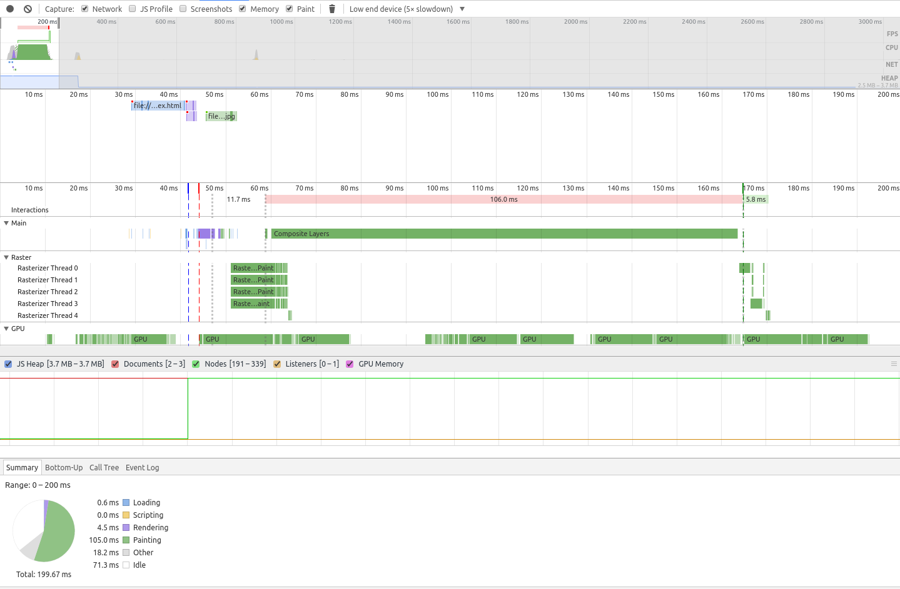

# Borders

## ✔ Simple CSS

```css
:root {
  --width: 300px;
  --height: 100px;
  --top-color: #f44336;
  --bottom-color: #2196F3;
}

.separator {
  width: 0;
  height: 0;
  border-style: solid;
  border-width: var(--height) var(--width) 0 0;
  border-color: var(--top-color) var(--bottom-color) transparent transparent;
}
```

###### Reversed

```css
.separator.reverse {
  border-width: var(--height) 0 0 var(--width);
  border-color: var(--top-color) transparent transparent var(--bottom-color);
}
```

###### Vertical

```css
.separator.vertical {
  border-width: var(--height) var(--width) 0 0;
  border-color: var(--left-color) var(--right-color) transparent transparent;
}
```

###### Reversed Vertical

```css
.separator.vertical.reverse {
  border-width: 0 var(--width) var(--height) 0;
  border-color: transparent var(--left-color) var(--right-color) transparent;
}
```

**Notes**:

- 👍 The angle is controlled by the element `height` value
- 👎 Cannot be used with percentage measurement unit _(`%`)_, any other unit is valid: _(`cm`, `em`, `ex`, `in`, `mm`, `pc`, `pt`, `px`)_
- 👎 For use in a full width or height scenarios matching the viewport, use viewport units: _(`vw`, `vh`, `vmin`)_
- 👎 Further control is limited
  - _e.g._ creating a shadow effect using `box-shadow`

## ✔ Generated Content

Can be used with the `::before` and `::after` pseudo-elements to generate HTML content for the separator without directly modifying your DOM.

###### Example

```css
section {
  ...
}

section::after {
  content: '';
  display: block;
  width: 0;
  height: 0;
  border-style: solid;
  border-width: 50px 300px 0 0;
  border-color: yellow black transparent transparent;
}
```

## ✔ Cross Browser Support

[Supported on all browsers](http://caniuse.com/#search=border-color)

## ✖ Performance



## Demo

View [Demo][demo], Play on [CodePen][pen], or inspect the [source files](index.html).

[demo]: https://raw.githack.com/ahmadnassri/css-diagonal-separators/master/borders/index.html
[pen]: http://codepen.io/ahmadnassri/pen/eBabKo
