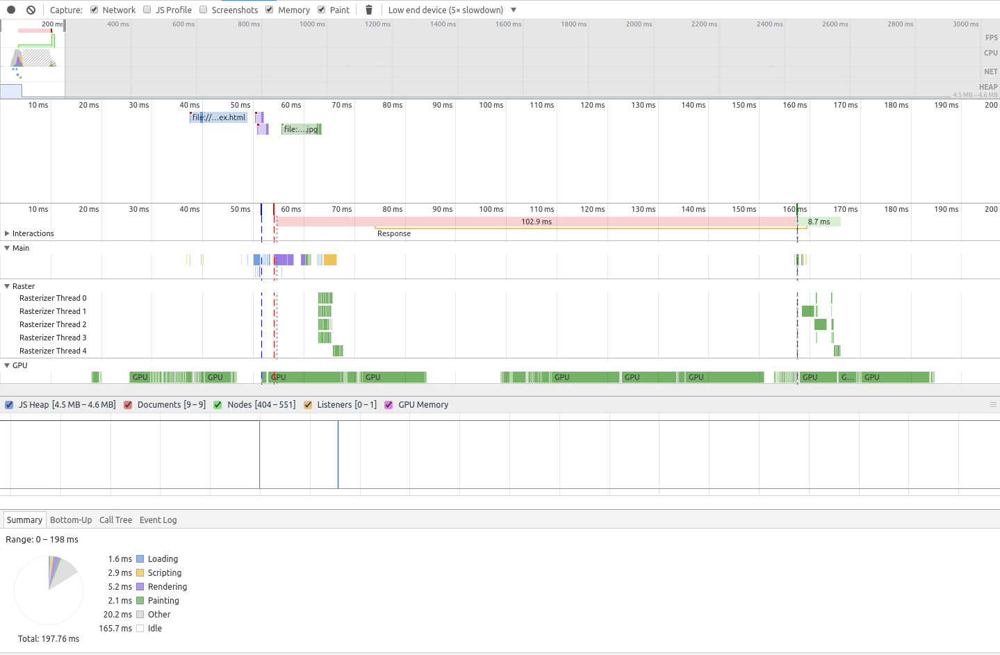

# Gradient Background Image

## ✔ Simple CSS

```css
:root {
  --width: 100%;
  --height: 100px;
  --top-color: #f44336;
  --bottom-color: #2196F3;
}

.separator {
  width: var(--width);
  height: var(--height);
  background-image: linear-gradient(to bottom right, var(--top-color), var(--top-color) 50%, var(--bottom-color) 50%, var(--bottom-color));
}
```

###### Reversed

```css
.separator.reverse {
  background-image: linear-gradient(to bottom left, var(--top-color), var(--top-color) 50%, var(--bottom-color) 50%, var(--bottom-color));
}
```

###### Reversed Vertical

```css
.separator.vertical.reverse {
  background-image: linear-gradient(to top right, var(--top-color), var(--top-color) 50%, var(--bottom-color) 50%, var(--bottom-color));
}
```

**Notes:**

- 👍 The angle is controlled by the element height value
- 👎 Jagged / blurry edges on some rendering engines
  - tweak the percentage a little to get a better rounding algorithm.
- 👎 Further control is limited
  - _e.g._ creating a shadow effect using `box-shadow`

## ✔ Generated Content

Can be used with the `::before` and `::after` pseudo-elements to generate HTML content for the separator without directly modifying your DOM.

###### Example

```css
section {
  ...
}

section::after {
  width: 100%;
  height: 50px;
  background-image: linear-gradient(to bottom right, yellow, yellow 50%, black 50%, black);
}
```

## ✖ Cross Browser Support

[Partial support](http://caniuse.com/#feat=css-gradients)

> Supported in all major browsers, with the exception of `Opera Mini`.

## ✔ Performance



## Demo

View [Demo][demo], Play on [CodePen][pen], or inspect the [source files](index.html).

[demo]: https://raw.githack.com/ahmadnassri/css-diagonal-separators/master/gradients/index.html
[pen]: http://codepen.io/ahmadnassri/pen/aBrPKb
