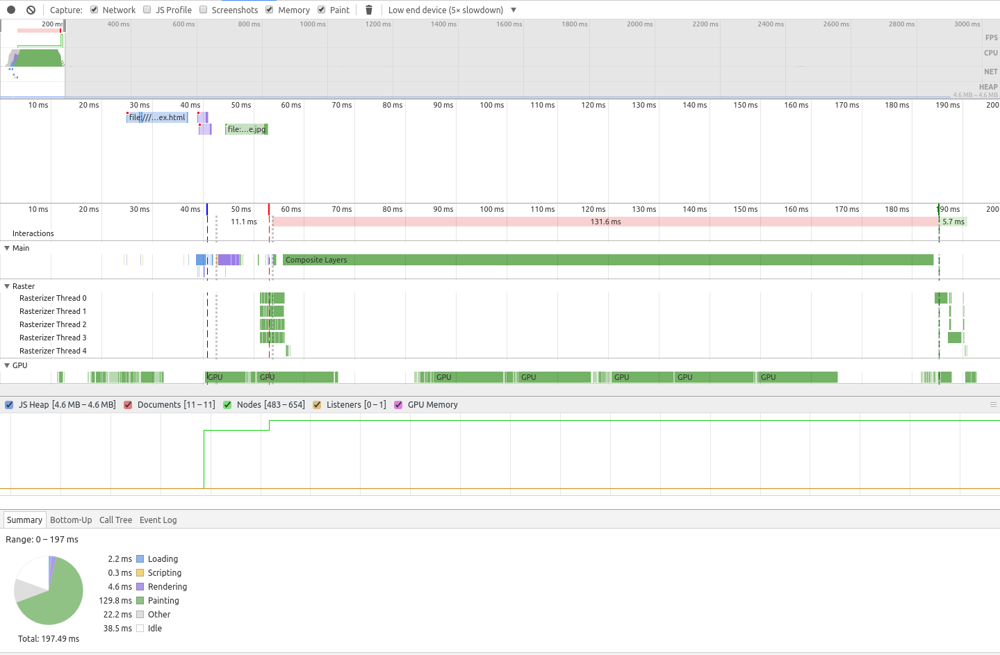

# CSS Shapes

## ✖ Simple CSS

```css
:root {
  --width: 100%;
  --height: 100px;
  --top-color: #f44336;
  --bottom-color: #2196F3;
}

.separator {
  position: relative;
  width: var(--width);
  height: var(--height);
}

.separator::before {
  position: absolute;
  content: "";
  width: 100%;
  height: 100%;
  background-color: var(--top-color);
  clip-path: polygon(100% 0, 0 0, 0 100%);
}

.separator::after {
  position: absolute;
  content: "";
  width: 100%;
  height: 100%;
  background-color: var(--bottom-color);
  clip-path: polygon(100% 0, 0 100%, 100% 100%);
}
```

###### Reversed

```css
.separator.reverse::before {
  clip-path: polygon(0 0, 100% 0, 100% 100%);
}

.separator.reverse::after {
  clip-path: polygon(0 0, 0% 100%, 100% 100%);
}
```

###### Reversed Vertical

```css
.separator.vertical.reverse::before {
  clip-path: polygon(0 0, 0% 100%, 100% 100%);
}

.separator.vertical.reverse::after {
  clip-path: polygon(0 0, 100% 0, 100% 100%);
}
```

**Notes:**

- 👍 The angle is controlled by the element height value
- 👎 Requires the use of generated content
- 👎 Further control is limited
  - _e.g._ creating a shadow effect using `box-shadow`

## ✖ Generated Content

**Cannot** be used with the `::before` and `::after` pseudo-elements as it relies on them already to generate the HTML content for the separator.

## ✖ Cross Browser Support

[Partial support](http://caniuse.com/#feat=css-clip-path)

## ✖ Performance



## Demo

View [Demo][demo], Play on [CodePen][pen], or inspect the [source files](style.css).

[demo]: https://raw.githack.com/ahmadnassri/css-diagonal-separators/master/shapes/index.html
[pen]: http://codepen.io/ahmadnassri/pen/bByOKv
